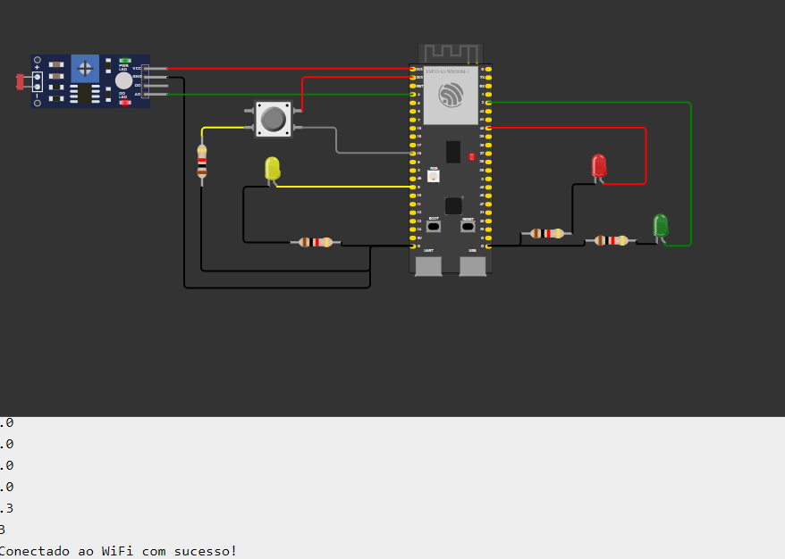
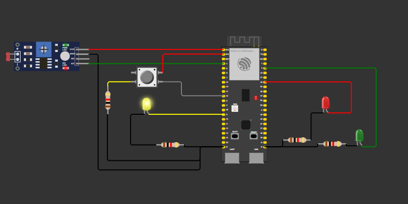
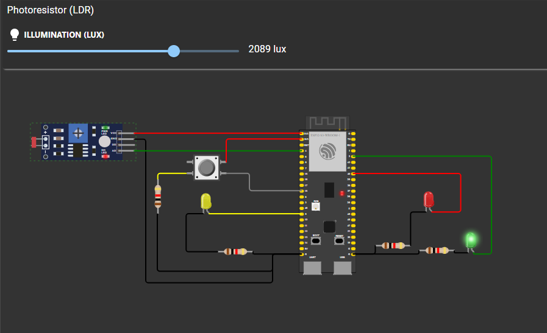
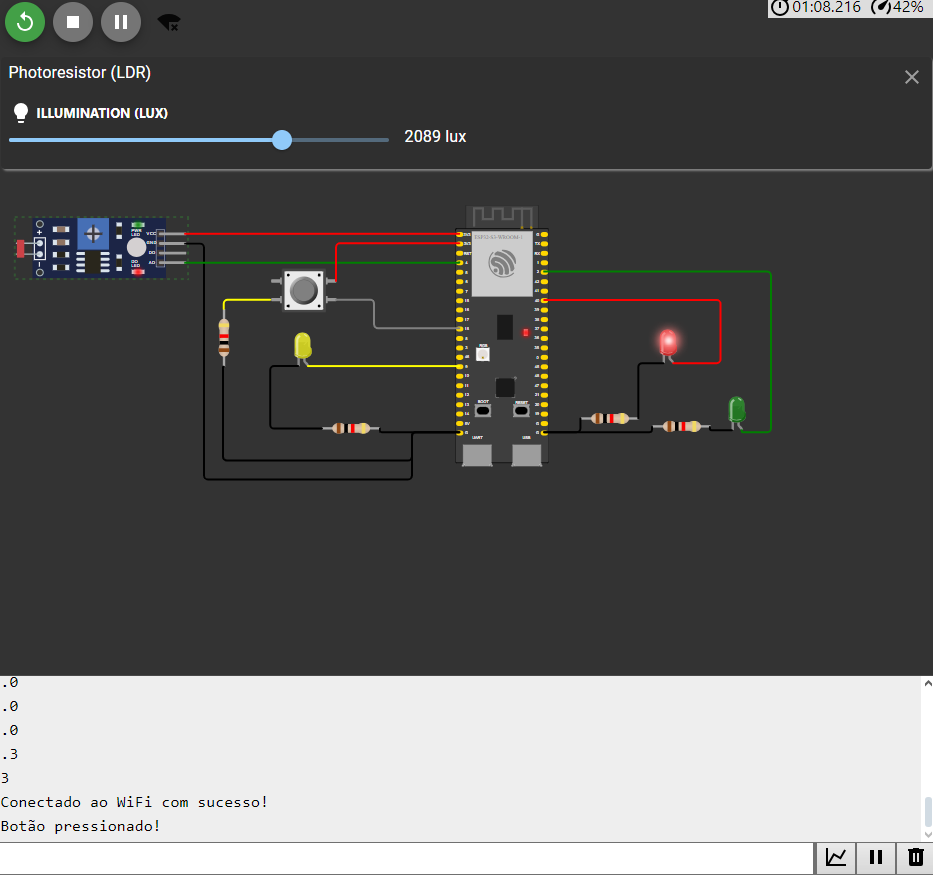
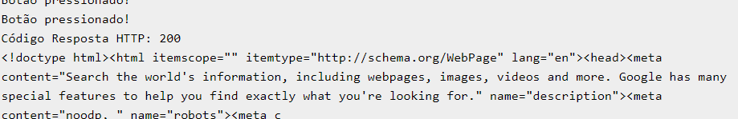
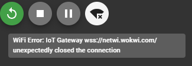

# Prova Modulo 4 Prática Periquito
 
## Estados do Sistema

### Início
- Conectando

### Conectado
- Convencional
    - Vermelho
        - Com botão apertado 3 vezes -> Requisição
        - Com botão apertado (botaoFoiPressionado == true) -> Desligar vermelho em 1 segundo
        - Sem apertar botão -> Duração completa do intervalo de troca do vermelho
    - Verde
        - Duração completa do intervalo de troca
    - Amarelo
        - Duração completa do intervalo de troca
- Noturno
    - Amarelo
        - Se mantém 1 segundo ligado, e desliga
    - Desligado
        - Se mantém 1 segundo desligado, e liga
     
# Imagens do funcionamento:

 ___________________________________________ 
 ___________________________________________ 
 ___________________________________________ 
 
 ___________________________________________ 
# Principais problemas de fazer esse exercício no Wokwi:

 
&emsp;Este erro acontecia constantemente com o WiFi, sem nenhuma causa aparente, as vezes desconectando até no meio da simulação.

&emsp; O erro de build do Wokwi (que já havia sido mostrado em aula) ocorreu também várias vezes, mas ironicamente, quando tive a ideia de documentar estes erros, ele conseguiu buildar corretamente todas as vezes seguintes. Acho que ficou com medo de aparecer rs